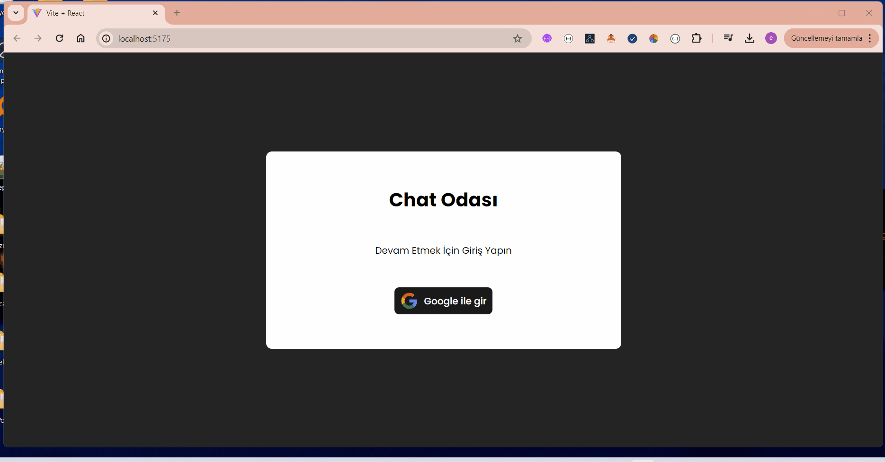

# React + Vite

https://firebase.google.com/  is the real guide for this project.

-At first you need to connect your project with your firebase account,firebaseConfig.
-Check the methods you want to use at your app from the search side like which I used link https://firebase.google.com/docs/firestore/manage-data/add-data
-Add the firebase storage for your media files,Cloud Storage is designed to help you quickly and easily store and serve user-generated content, such as photos and videos..

